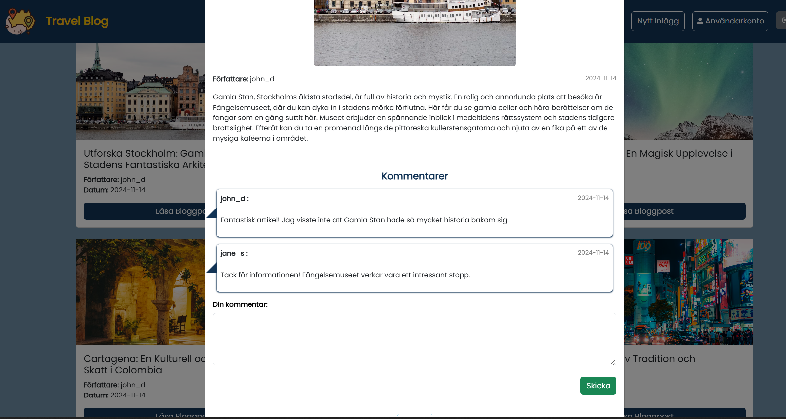
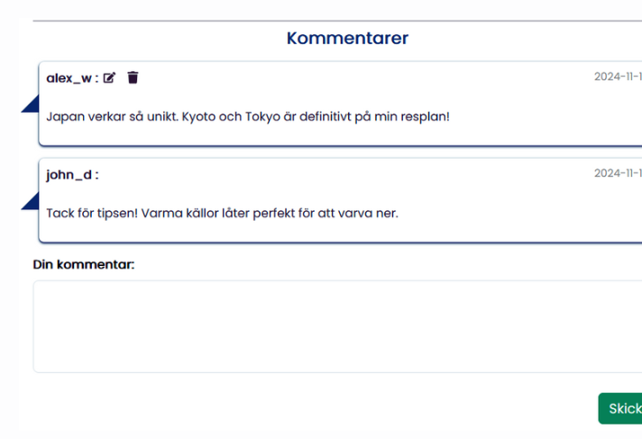

#### November 2024

#### The development team behind Travel BLOG: Gözde Akun, Pedram Hejazi and Ursula Vallejo.

### 📋 Project Summary

_Travel Blog_ is a fullstack web application designed for adventure lovers and explorers to share their travel stories and connect with a community.

The project features a responsive frontend built with React and Bootstrap, a secure backend powered by Node.js and Express, and a PostgreSQL database for persistent storage. The entire application is containerized and managed using Docker Compose, with NGINX serving as a reverse proxy.

Key functionalities include:

- User registration and login with JWT-based authentication
- GDPR-compliant data handling and user consent
- Create, read, update, and delete blog posts
- Browse and read blog posts about various adventures and places
- Create new posts to share personal experiences
- Leave comments on other users' blog posts
- Image upload and compression with Multer and Jimp
- Responsive design optimized for both desktop and mobile devices
- Automated database initialization for consistent deployment

The application is deployed on a dedicated Microsoft Azure server and optimized for performance and scalability.

---

### 🛠️ Technologies Used

- **React** — with Hooks and state management
- **Bootstrap** — for fast and responsive design
- **Node.js** & **Express** — for backend API
- **PostgreSQL** — for database storage

---

### General view:

[](LogIn-register-view)

[](update-user-info)

[](Main-page-view)

[](card-post-detail)

[](post-view)

[](create-post)

[](comments-view)

[](comments-detail)

[](alerts-detail)

---

### 📄 [Detailed Information of the Project](Detail_Info.md)

---

### 🔧 Installation and Usage

**Prerequisites:**
Make sure you have [Docker](https://www.docker.com/) installed and running on your system.
The application uses **Docker Compose** to manage the following containers:

- PostgreSQL database
- Backend (Node.js + Express)
- Frontend (React) — served through NGINX

The configuration is defined in the `compose.yaml` file, which initializes and connects all services.

---

### 1️⃣ Running the Application with Docker Compose

If you want to run the entire app with **Docker Compose** (recommended for deployment or full integration testing):

```bash
docker compose up --build
```

- This command will:

  - Build and start the **backend** container.
  - Build the **frontend** container → which uses `npm run build` to create a static build → served by NGINX.
  - Start the **PostgreSQL database** container.
  - NGINX acts as a reverse proxy → it serves the frontend and routes API requests to the backend.

👉 With this method, you do NOT need to run `npm run dev` manually — the built frontend is served by NGINX.
👉 The backend is also running inside the container (you don’t need to run `npm run build-frontend` separately).

---

### 2️⃣ Running Locally (Development mode)

If you want to run the app locally during development (for example, when editing React code and seeing changes immediately):

#### Step 1 — Start PostgreSQL via Docker Compose:

```bash
docker compose up database
```

- This will start only the database.

#### Step 2 — Start Backend manually:

```bash
cd backend
npm install
npm run dev
```

- This runs the backend on `localhost:3000` (Node.js + Express).

#### Step 3 — Start Frontend manually:

```bash
cd frontend
npm install
npm run dev
```

- This runs the frontend on `localhost:5173` or `localhost:3001` depending on your config.
- In this mode, you can see changes live while editing React components.

---

### Important Notes

- In **production** (when running with full `docker compose up`), NGINX serves the frontend static files and proxies `/api/`, `/users/`, `/uploads/` requests to the backend.
- The `compose.yaml` file ensures the containers start in the correct order with `depends_on`.
- The backend and frontend containers are built using **multi-stage Dockerfiles**:

  - Frontend is built first (with `npm run build`), then the static files are copied to NGINX.
  - Backend runs with Node.js + Express.

---

### Summary of commands

| Mode            | Command                      | Behavior                                        |
| --------------- | ---------------------------- | ----------------------------------------------- |
| Full production | `docker compose up --build`  | Backend, Frontend (NGINX), DB run in containers |
| DB only         | `docker compose up database` | Only DB container runs                          |
| Backend dev     | `cd backend && npm run dev`  | Run backend locally                             |
| Frontend dev    | `cd frontend && npm run dev` | Run frontend locally                            |

---

### 🗺️ Architecture Overview (Docker / Application Flow)

```

+-------------------------+
\|      User Browser       |
\|      (Frontend UI)      |
+-------------------------+
|
v
+-------------------------+
\|         NGINX           |  --> Serves static files (React build)
\| (Reverse Proxy + Web Server) --> Proxies API requests to backend
+-------------------------+
|
v
+-------------------------+
\|      Backend (Node.js)  | --> Handles API logic, JWT auth, GDPR logic, image upload
\|      Express server     |
+-------------------------+
|
v
+-------------------------+
\|  PostgreSQL Database    | --> Stores users, blog posts, comments, images (paths)
+-------------------------+

```

### Docker Compose (compose.yaml)

- **NGINX container** → serves frontend (React build) + reverse proxy to backend.
- **Backend container** → runs Node.js / Express API.
- **Database container** → runs PostgreSQL with persistent volume.

**Compose flow:**

- `depends_on:` ensures the database starts first.
- Backend waits for DB → initializes models / tables.
- Frontend is built and served via NGINX.

### Local Development

```

Frontend Dev → npm run dev → [http://localhost:5173](http://localhost:5173)
Backend Dev  → npm run dev → [http://localhost:3000/api](http://localhost:3000/api)
DB           → docker compose up database

```

### Production (Full Docker Compose)

```

docker compose up --build
Frontend → served on port 80 (NGINX)
API calls → NGINX → /api → Backend → Database

```
