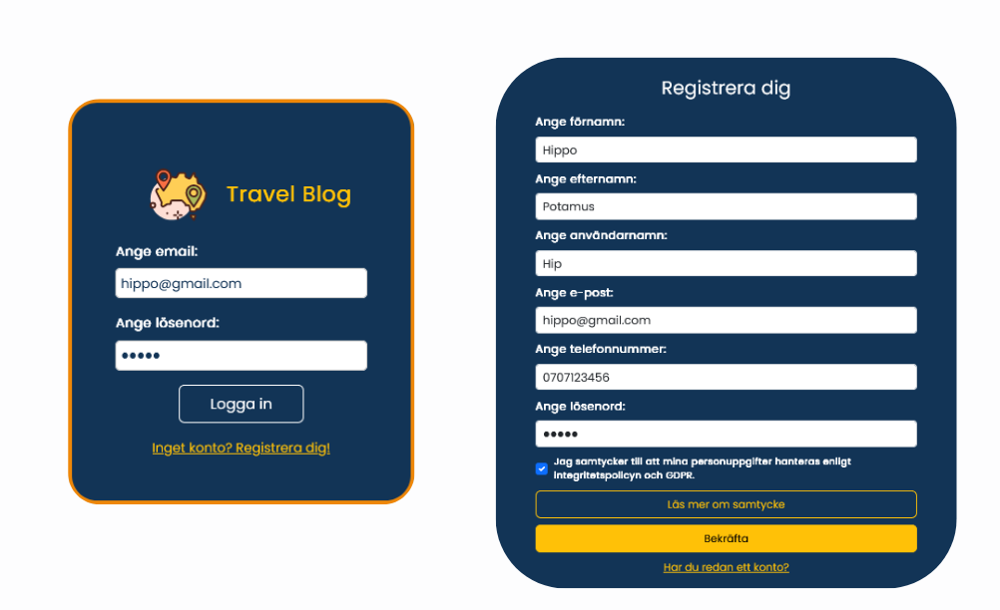

#### November 2024

#### The development team behind Travel BLOG: Gözde Akun, Pedram Hejazi and Ursula Vallejo.

### 📋 Project Summary

_Travel Blog_ is a fullstack web application designed for adventure lovers and explorers to share their travel stories and connect with a community.

The project features a responsive frontend built with React and Bootstrap, a secure backend powered by Node.js and Express, and a PostgreSQL database for persistent storage. The entire application is containerized and managed using Docker Compose, with NGINX serving as a reverse proxy.

Key functionalities include:

- User registration and login with JWT-based authentication
- GDPR-compliant data handling and user consent
- Create, read, update, and delete blog posts
- Browse and read blog posts about various adventures and places
- Create new posts to share personal experiences
- Leave comments on other users' blog posts
- Image upload and compression with Multer and Jimp
- Responsive design optimized for both desktop and mobile devices
- Automated database initialization for consistent deployment

The application is deployed on a dedicated Microsoft Azure server and optimized for performance and scalability.

---

### 🛠️ Technologies Used

- **React** — with Hooks and state management
- **Bootstrap** — for fast and responsive design
- **Node.js** & **Express** — for backend API
- **PostgreSQL** — for database storage

---

### General view:

---

### 📄 [Detailed Information of the Project](Detail_Info.md)
